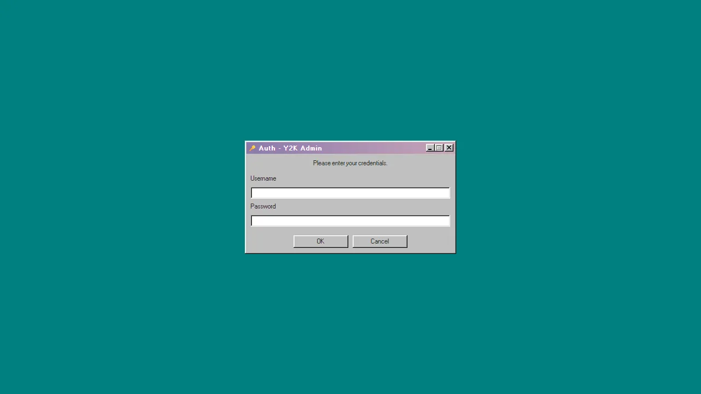

<div align="center">

<pre>
 __   _____   ___ ____  ____  _
 \ \ / / _ \ ( _ )___ \| __ )| | ___   __ _
  \ V / (_) |/ _ \ __) |  _ \| |/ _ \ / _` |
   | | \__, | (_) / __/| |_) | | (_) | (_| |
   |_|   /_/ \___/_____|____/|_|\___/ \__, |
                                      |___/
</pre>

  <h1>Y982Blog (Y2K Pixel Blog)</h1>
  <p><strong><a href="README.md">English</a></strong> | 中文</p>
  <p><em>打破传统瀑布流，带你重返千禧年的赛博桌面。</em></p>
</div>

一个自托管的博客引擎。它用一整张可交互的 Windows 98 风格桌面取代了传统的网页布局，文章、图文集和评测面板都以可拖拽、可堆叠的窗口形式，运行在粒子特效画布之上。

## 为什么与众不同？

在当今千篇一律的 WordPress、Hexo 和各种现代化极简博客引擎中，**Y982Blog** 选择了一条彻底复古与反叛的道路：

**拒绝无限下拉瀑布流**：我们摒弃了现代网页单调的滚动阅读体验。您的整个博客就是一张铺满粒子交互特效的无尽画布，所有文章、图片和评分面板都以经典的 **Windows 98 可拖拽窗口** 呈现。读者可以同时打开多个窗口，像操作真正的操作系统一样自由探索您的数字花园！

**真正的「原生中文」极速搜索**：不需要复杂的 Elasticsearch 部署！我们深度挖掘了 PostgreSQL 的性能，直接基于 GIN 索引与 `pg_trgm` 扩展构建了支持中日韩文的全文搜索引擎。键入 `#标签` 或是 `~文本`，内容瞬间直达。

**为极客打造的全栈架构**：
- **前端 (Next.js 16)**：服务端渲染保障 SEO 加持下的极速首屏，完美管理复杂的桌面窗口层级状态。
- **后台 (Vite + 98.css)**：拥有一个完全独立、无需妥协的 SPA 后台面板，还原最原汁原味的 Win98 灰白视觉控制台操作体验。
- **后端 (Go 1.23 + Gin)**：极度轻量的高并发核心，自带 Let's Encrypt 前后端独立域名的全自动 SSL 热发证系统与 JWT 安全防护。

> **开源与版权**：本项目完全基于 [MIT License](LICENSE) 免费开源，您的数据与创作完全受您自己掌控。您可以肆意将其部署为自己的极客基地、影视评分站或是摄影集。我们只提供极致复古的骨架，而灵魂由你注入。

## 界面演示

### 粒子特效与窗口动画


### 前端桌面浏览体验


### 基于 98.css 的管理后台


## 架构

```
┌──────────────────────────────────────────────────────┐
│                   Nginx (:80/:443)                   │
│  blog.example.com  │  admin.example.com  │  /api/*   │
└─────────┬──────────┴──────────┬──────────┴─────┬─────┘
          │                     │                │
    ┌─────▼─────┐        ┌─────▼─────┐    ┌─────▼─────┐
    │ 前端博客  │        │ 管理后台  │    │  Go API   │
    │ Next.js   │        │ Vite SPA  │    │  Gin      │
    │ :3000     │        │ :80       │    │  :8080    │
    └───────────┘        └───────────┘    └─────┬─────┘
                                                │
                                          ┌─────▼─────┐
                                          │PostgreSQL │
                                          │ :5432     │
                                          └───────────┘
```

## 项目结构

```
.
├── frontend/          Next.js 16 — 前端博客
│   ├── app/           App Router 页面
│   ├── components/    React 组件 (Window, Spotlight, Taskbar 等)
│   ├── lib/           API 客户端、工具函数
│   └── public/        静态资源
├── admin/             Vite + React — 管理后台 (98.css 风格)
│   └── src/
│       ├── pages/     仪表盘、文章编辑器、设置、登录
│       ├── api/       Axios API 客户端
│       └── context/   认证上下文 (JWT)
├── backend/           Go + Gin — REST API 服务
│   ├── cmd/server/    入口、路由、服务器启动
│   ├── internal/
│   │   ├── handler/   HTTP 处理器 (34 个路由)
│   │   ├── service/   业务逻辑
│   │   ├── repository/ 数据库查询
│   │   ├── model/     数据模型
│   │   └── middleware/ JWT 认证、CORS
│   └── migrations/    PostgreSQL 迁移脚本 (001–009)
├── docker-compose.yml 5 服务生产编排
├── nginx.conf         多域名反向代理配置
├── .env.example       环境变量模板
└── README.md
```

## 快速开始（开发环境）

### 前置条件

- Go 1.23+
- Node.js 20+
- Docker（用于 PostgreSQL）

### 步骤

```bash
# 1. 启动 PostgreSQL
docker compose up db -d

# 2. 启动后端 API
cd backend
cp .env.example .env        # 按需修改
go run ./cmd/server/         # → http://localhost:8080

# 3. 启动前端（另开终端）
cd frontend
npm install
npm run dev                  # → http://localhost:3000

# 4. 启动管理后台（另开终端）
cd admin
npm install
npm run dev                  # → http://localhost:5173
```

首次启动后，访问管理后台并按照引导创建管理员账户。

## 生产部署

```bash
# 1. 配置环境变量
cp .env.example .env
# 编辑 .env：设置 JWT_SECRET、DB_PASSWORD 等
# 生成密钥：openssl rand -base64 32

# 2. 修改 nginx.conf
# 将 example.com 替换为实际域名

# 3. 构建并启动所有服务
docker compose up -d --build

# 4. 配置域名和 SSL
# 打开管理后台 → 设置 → 域名 & SSL
# 设置前端/后台域名
# 选择 SSL 模式：auto（Let's Encrypt）或 manual（上传 PEM）
```

### Docker 服务清单

| 服务       | 镜像               | 职责                                 |
|------------|---------------------|--------------------------------------|
| `db`       | postgres:16-alpine | 数据库，含 pg_trgm 扩展             |
| `api`      | Go 1.23（自定义）  | REST API、SSL 终端                  |
| `frontend` | Node 20（自定义）  | Next.js standalone SSR 服务         |
| `admin`    | Nginx Alpine       | Vite 构建的 SPA，含 SPA 路由回退    |
| `nginx`    | nginx:alpine       | 反向代理、请求限流、静态资源缓存     |

## 环境变量

| 变量           | 必填 | 默认值           | 说明                               |
|----------------|------|------------------|------------------------------------|
| `JWT_SECRET`   | 是   | —                | JWT 签名密钥                       |
| `DB_USER`      |      | `blog`           | PostgreSQL 用户名                  |
| `DB_PASSWORD`  |      | `blog`           | PostgreSQL 密码                    |
| `API_URL`      |      | `http://api:8080`| 前端 SSR 使用的后端地址            |
| `ADMIN_API_URL`|      | `/api`           | 管理后台使用的后端地址             |
| `AI_API_URL`   |      | —                | OpenAI 兼容 API 端点               |
| `AI_API_KEY`   |      | —                | AI API 密钥                        |
| `AI_MODEL`     |      | `deepseek-chat`  | AI 摘要使用的模型名称              |

域名和 SSL 设置通过管理后台配置，不使用环境变量。

## API

后端共提供 34 个 REST 端点，分为三组：

### 公开接口

| 方法 | 路径                | 说明                                   |
|------|---------------------|----------------------------------------|
| GET  | `/api/boards`       | 板块树                                 |
| GET  | `/api/boards/:slug` | 板块内容列表（分页、排序、类型筛选）   |
| GET  | `/api/posts/:slug`  | 单篇内容（文章/图文/评分/页面）        |
| GET  | `/api/search?q=`    | 搜索（默认 / `#标签` / `~全文`）       |
| GET  | `/api/tags`         | 所有标签及使用次数                     |
| GET  | `/api/menu`         | 导航菜单数据                           |
| GET  | `/api/ai/summary`   | AI 生成的摘要（带缓存）               |
| GET  | `/api/og/:slug`     | Open Graph 元数据                      |
| GET  | `/api/preview/:token` | 令牌验证的安全预览                   |
| GET  | `/api/css-config`   | 自定义 CSS 配置                        |
| GET  | `/feed.xml`         | RSS 2.0 订阅源                         |
| GET  | `/sitemap.xml`      | XML 站点地图                           |
| GET  | `/robots.txt`       | 爬虫指引                               |

### 认证接口

| 方法 | 路径                       | 说明                     |
|------|----------------------------|--------------------------|
| POST | `/api/admin/login`         | 登录（bcrypt + 验证码）  |
| GET  | `/api/admin/captcha`       | 数学验证码               |
| GET  | `/api/admin/login/status`  | IP 封禁状态查询          |
| GET  | `/api/setup/status`        | 首次运行检测             |
| POST | `/api/setup/initialize`    | 创建初始管理员           |

### 管理接口（需 JWT）

| 方法   | 路径                             | 说明             |
|--------|----------------------------------|------------------|
| GET    | `/api/admin/posts`               | 按状态列出文章   |
| POST   | `/api/admin/posts`               | 创建文章         |
| PUT    | `/api/admin/posts/:slug`         | 更新文章         |
| DELETE | `/api/admin/posts/:slug`         | 永久删除文章     |
| POST   | `/api/admin/posts/:slug/trash`   | 移入回收站       |
| POST   | `/api/admin/posts/:slug/restore` | 从回收站恢复     |
| DELETE | `/api/admin/trash`               | 清空回收站       |
| POST   | `/api/admin/preview/:slug`       | 生成预览令牌     |
| POST   | `/api/admin/boards`              | 创建/更新板块    |
| DELETE | `/api/admin/ai-cache/:slug`      | 清除 AI 缓存     |
| PUT    | `/api/admin/password`            | 修改密码         |
| GET    | `/api/admin/settings`            | 获取站点设置     |
| PUT    | `/api/admin/settings`            | 更新设置         |
| PUT    | `/api/admin/ssl`                 | 上传 SSL 证书    |
| DELETE | `/api/admin/ssl`                 | 移除 SSL 证书    |

## 内容类型

| 类型   | frontmatter `type` | 说明                                         |
|--------|---------------------|----------------------------------------------|
| 文章   | `article`          | 标准 Markdown 博客文章                       |
| 图文   | `photo`            | 多页图文并排（左图右文），支持翻页           |
| 评分   | `rating`           | 便签封面 + 雷达图 + AI 摘要 + 详细评测正文   |
| 页面   | `page`             | 独立静态页面（如"关于"），可选显示在菜单中   |

所有内容存储在 PostgreSQL 中，支持草稿、已发布、已回收三种状态。

## 搜索

搜索使用 PostgreSQL 的 `pg_trgm` 扩展配合 GIN 索引进行三元组匹配，天然支持中文、日文、韩文，无需额外分词器。

| 前缀   | 搜索范围                     | 示例         |
|--------|------------------------------|--------------|
| （无） | 标题、标签、摘要             | `像素设计`   |
| `#`    | 仅标签                       | `#科幻`      |
| `~`    | 全文（标题 + 正文 + 标签）   | `~粒子系统`  |

结果按 `similarity()` 相似度评分排序。

## SSL/TLS

SSL 通过管理后台按域名独立配置（设置 > 域名 & SSL）。前端域名和后台域名可以使用不同的 SSL 模式。

| 模式   | 行为                                                         |
|--------|--------------------------------------------------------------|
| 关闭   | 不启用 SSL，后端仅监听 `:8080` HTTP                          |
| 手动   | 通过管理后台上传 PEM 格式的证书和私钥                        |
| 自动   | 通过 `autocert` 自动申请 Let's Encrypt 证书，需公网 80 端口  |

当任一域名启用 SSL 时，后端在 `:443` 启动 HTTPS，在 `:80` 处理 ACME 验证和 HTTP 到 HTTPS 的重定向。证书通过 SNI（服务器名称指示）分发。

## 安全

- **密码存储**：bcrypt 哈希
- **身份验证**：JWT（HS256，24 小时过期）
- **防暴力破解**：登录数学验证码 + IP 失败计数 + 10 次失败后自动封禁 15 分钟
- **输入过滤**：仅接受 Markdown（禁止原始 HTML），渲染时经 DOMPurify 净化
- **SQL 注入**：全部使用参数化查询
- **SSL 密钥**：存储在数据库中，API 不返回原始 PEM（仅返回 `hasCert` 布尔值）
- **AI 密钥**：仅存储在服务端，前端只显示掩码值

## 技术栈

| 组件     | 技术                                        |
|----------|---------------------------------------------|
| 前端     | Next.js 16, React 19, TypeScript, zustand   |
| 管理后台 | Vite 5, React 19, TypeScript, 98.css, axios |
| 后端     | Go 1.23, Gin, PostgreSQL 16                 |
| 搜索     | pg_trgm（三元组索引，支持中日韩文）         |
| SSL      | autocert (Let's Encrypt) + 手动 PEM + SNI   |
| 部署     | Docker Compose, Nginx 反向代理              |
| SEO      | RSS 2.0, XML Sitemap, Open Graph, robots.txt|

## 数据库迁移

迁移脚本在 PostgreSQL 容器首次启动时自动执行（通过 `docker-entrypoint-initdb.d`）。对于已有数据库，需手动执行新迁移：

```bash
docker cp backend/migrations/009_chinese_search.sql y2k-blog-db:/tmp/
docker exec y2k-blog-db psql -U blog -d y2k_blog -f /tmp/009_chinese_search.sql
```

## 许可证

[MIT](LICENSE)
